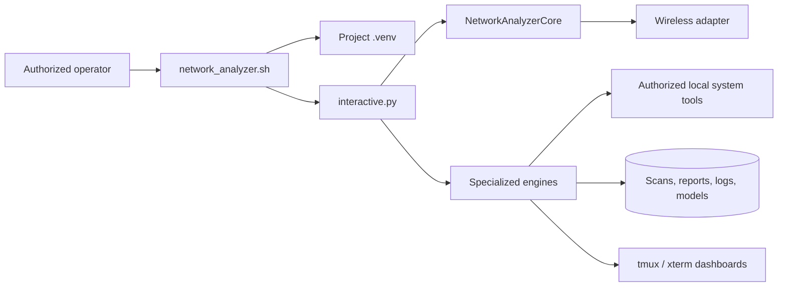
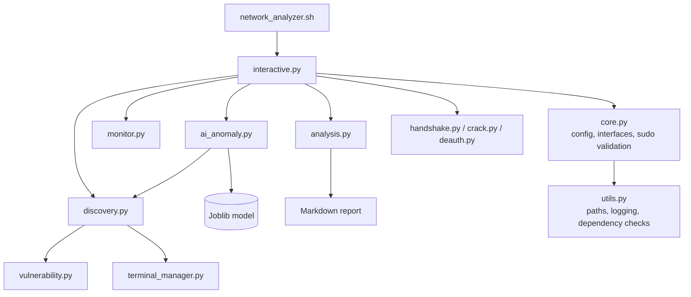
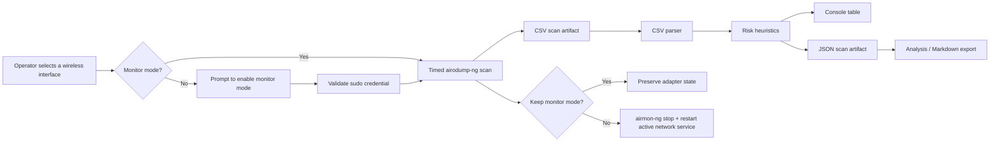
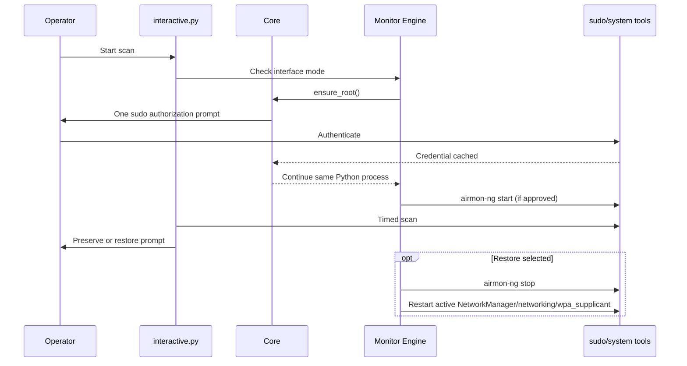

# Network Analyzer Architecture and Operations Guide

This document describes the 2026.08.21 architecture, runtime data flows, safety boundaries, and operating lifecycle. The tool is intended for authorized wireless assessments only.

## System context



## Component architecture



## Scan data-flow diagram



## Privilege and lifecycle sequence



`ensure_root()` validates `sudo` with `sudo -v`; it does not re-execute the Python process. This prevents prior answers such as scan duration from being lost and avoids duplicate dashboards.

## Runtime artifacts

| Location | Contents | Handling |
| --- | --- | --- |
| `scans/` | CSV capture output and parsed JSON | May contain nearby BSSID/ESSID identifiers. |
| `reports/` | Markdown summaries | Share only within the approved scope. |
| `logs/` | Dated runtime logs | Review before attaching to tickets. |
| `models/anomaly_model.joblib` | Locally trained Isolation Forest model | Derived from local observations; replace it only by retraining. |
| `data/anomaly_patterns.db` | SQLite anomaly snapshots, learned patterns, baselines, and incidents | Treat as sensitive local telemetry. A configured legacy `ai_patterns.json` can be imported once, but is not the active store. |
| `data/dev_automate_networks.db` | SQLite history of passively observed access points | Treat as sensitive local telemetry. |
| `.network_analyzer_active_iface` | Last selected adapter | Project-local state. |
| `.network_analyzer_monitor_state.json` | Recovery information for a monitor-mode transition | Retain while monitor mode may need restoration; do not edit manually. |

## Dependency and startup flow

1. `network_analyzer.sh` checks for Python 3 and `interactive.py`.
2. If Python modules are missing, it offers to create `.venv` and install `requirements.txt` there. It does not use global `pip`.
3. The launcher uses `exec` to hand the process to `interactive.py`; Bash contains no feature-command menu or dispatch table.
4. `interactive.py --init` checks system tools and can offer the package-manager mapping.
5. Initialization lists network interfaces and persists the selected interface.
6. Menu actions share one Python core instance, including active-interface and sudo authorization state.

Use the read-only diagnostic before an assessment:

```bash
python3 interactive.py --doctor
```

## Restore normal networking

After discovery and assessment scans, the tool asks whether to preserve monitor mode. Choose `n` to stop monitor mode and restart the first active service among `NetworkManager`, `networking`, and `wpa_supplicant`. Menu option **2** also performs this restoration path.

If the machine uses a non-systemd network stack, the tool reports that no active supported service was found; reconnect using the distribution’s network-management method.

## Tests and quality gates

The offline suite does not need a wireless adapter or root privileges:

```bash
python3 -m unittest discover -s tests -v
python3 -m compileall -q .
bash -n network_analyzer.sh folderstruc.sh
```

The test suite covers configuration path normalization, report generation, risk scoring, BSSID validation, and interface-selection persistence. Hardware-dependent behavior must be tested only in an authorized lab.
